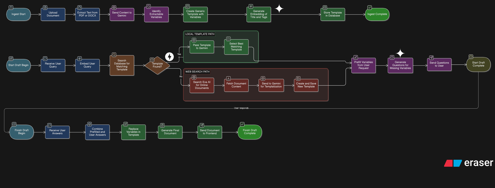

# Legal Document Templating & Drafting Assistant

A tiny full-stack app that ingests legal documents (PDF/DOCX), converts them into reusable templates with variables, and generates clean drafts via an interactive Q&A flow.

---


## 🔧 Tech Stack

- **Backend:** FastAPI
- **Frontend:** Next.js + Tailwind CSS
- **Embeddings:** Gemini embeddings
- **APIs:**
  - Google Gemini API 
  - Exa.ai


## ✨ What This App Does

1. **Ingests legal documents** (`.pdf`, `.docx`)
2. **Extracts reusable variables** using Gemini LLM
3. **Converts documents into templates** with JSON front-matter
4. **Stores templates & variables in a database**
5. **Drafts new documents** from natural-language user requests
6. **Asks human-friendly questions** for missing information
7. **Generates final drafts**
8. Auto-bootstraps templates from the web when none exist (via `exa.ai`)

---

## 🧠 High-Level Architecture



---

## 🧩 Core Flows
<details>
<summary>Flow</summary>

### 1. Template Ingestion → Templatization
- Upload `.pdf` or `.docx`
- Extract clean text
- Use Gemini to:
  - Identify reusable variables
  - Deduplicate logically equivalent fields
  - Propose similarity tags
- Replace spans with `{{variable_key}}`
- Save Markdown template + metadata

### 2. Drafting Flow
- User asks:  
  > "Draft a mutual Non-Disclosure Agreement ”
- System:
  - Finds closest template (tags + embeddings + LLM classifier)
  - Shows match confidence & alternatives
  - Pre-fills fields from user query when possible
  - Asks human-readable questions for missing variables
  - Renders final draft

### 3. No Template Found 
- Search web using `exa.ai`
- Fetch public legal exemplars
- Ingest → templatize → store
- Continue drafting seamlessly
---
</details>


## 📃 Template Format

<details>
<summary>Template</summary>

```json
{
        "title": "Employment Agreement",
        "similarity_tags": ["employment", "hr", "job_contract"],
        "body": """
    # EMPLOYMENT AGREEMENT

This Employment Agreement (“Agreement”) is entered into on {{effective_date}}** between {{employer_name}}....
""",
        "variables": [
            {
                "key": "employer_name",
                "label": "Employer Name",
                "example": "ABC Technologies Pvt Ltd",
                "required": True,
                "dtype": "string",
            },
            {
                "key": "employee_name",
                "label": "Employee Name",
                "example": "Rahul Sharma",
                "required": True,
                "dtype": "string",
            },...
        ],
    },
```
</details>

## 🚀 Running the Project (Docker)

This project is fully containerized and runs using **Docker Compose**.

## Prerequisites✅
- [Docker](https://www.docker.com/)
- [Gemini](https://aistudio.google.com/)
- [Exa.ai](https://exa.ai/)

## 🔐 Environment Variables
<details>
<summary>Environment Variables</summary>

Create a `.env` file in the **both client and server folder** and fill in the following values:

```env
GOOGLE_API_KEY= gemini_api_key
DATABASE_URL= db_url
EXA_API_KEY=  exa_api_key
CORS_ORIGINS=http://localhost:3000,http://127.0.0.1:3000,[your frontend url]

NEXT_PUBLIC_API_URL=
```
</details>

## ▶️ Start the Application
<details>
<summary>Start Application</summary>

From the project root, run:
```bash
docker compose up --build
```

To stop 
```bash
docker compose down
```

</details>